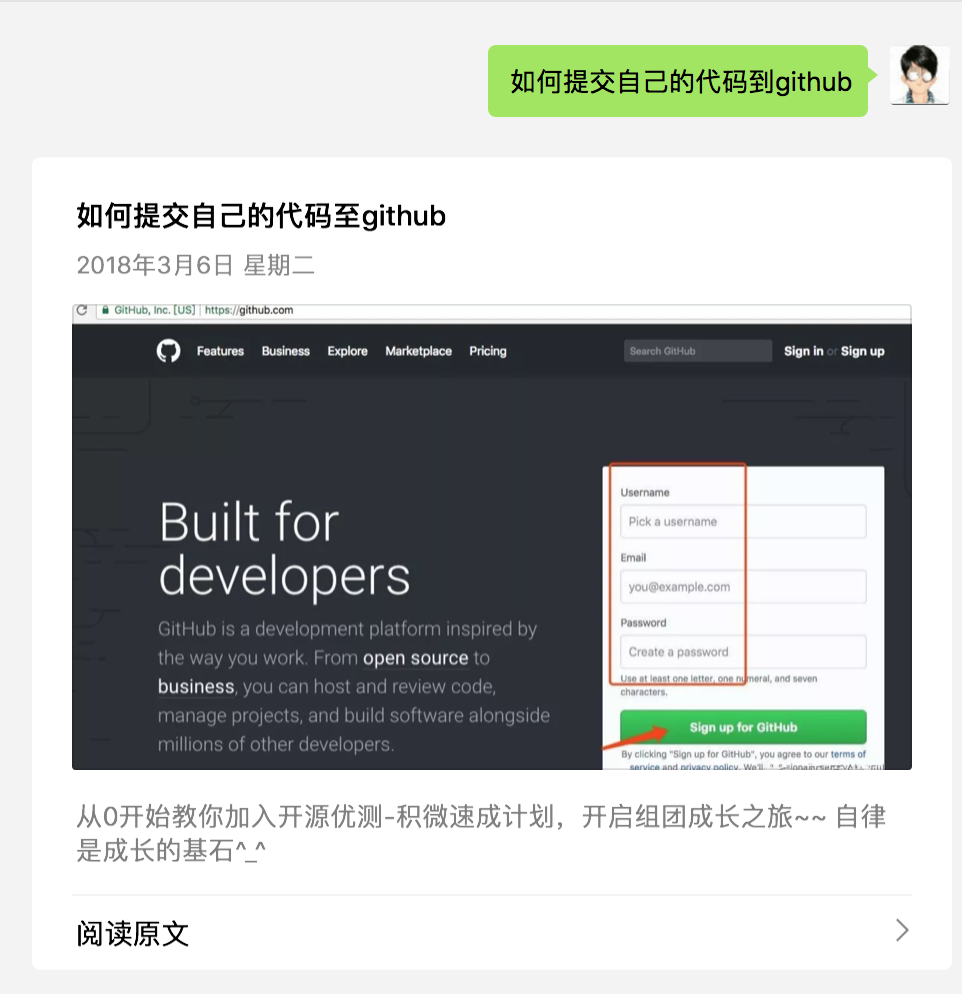

## 说明

刚加入的第二期的同行请先按以下动作进行操作

1. 在github.com注册一个账号

2. fork我们的github项目，以方便后续提交任务代码

我们的github项目地址：https://github.com/small99/deeptest

3. 关注公众号：

在公众号中回复如图所示获取对于教程文章

查阅文章《如何提交自己的代码至github》

## 注

参与第二期的人员，请在第二期的目录下按：城市-昵称 方式创建自己的工作目录

